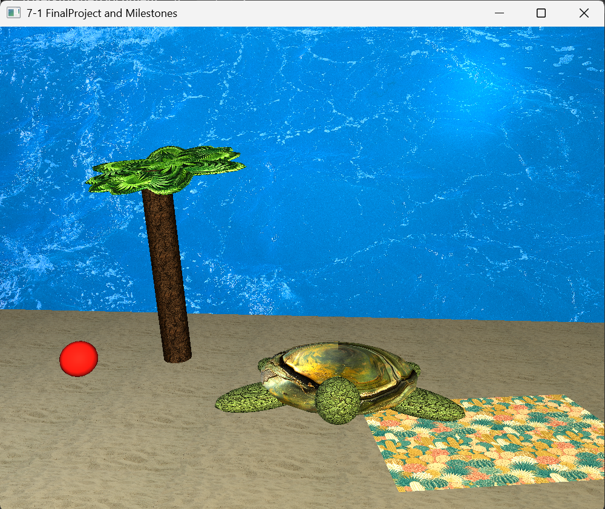
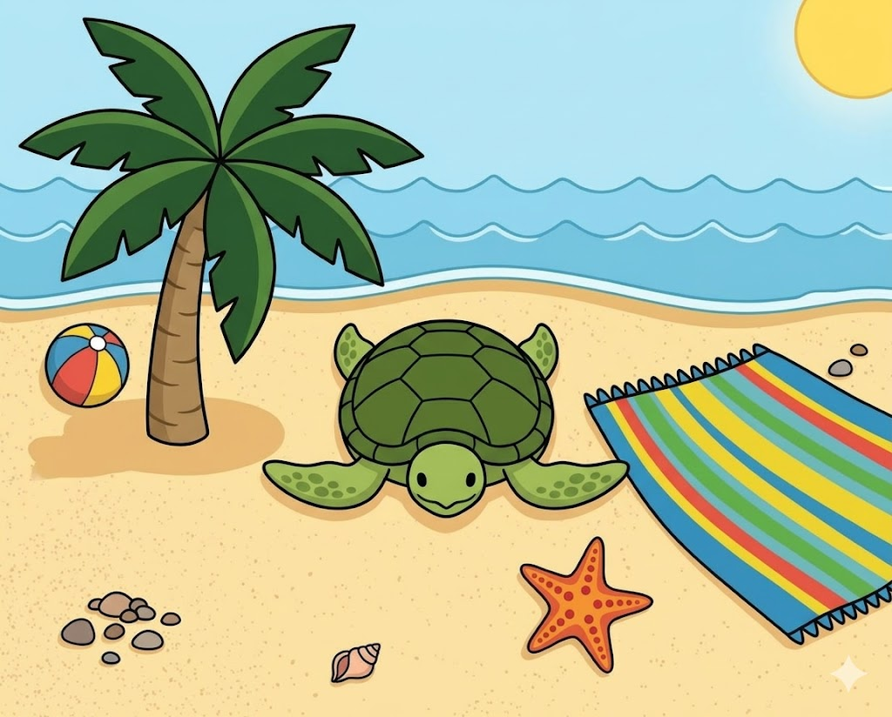

# OpenGL 3D Beach Scene
 
A fully realized 3D beach scene built with C++ and OpenGL for CS-330: Computational Graphics and Visualization at SNHU. The scene was constructed from a 2D reference image and recreated using only primitive shapes, custom textures, Phong lighting, and an interactive camera system.
 
---
 
## Scene Preview
 
| Rendered Scene | Reference Image |
|---|---|
|  |  |
 
---
 
## What Is In the Scene
 
The scene was built from a 2D illustration of a beach and translated into 3D using primitive mesh combinations.
 
| Object | Primitives Used | Notes |
|---|---|---|
| Sea Turtle (shell) | Sphere, flattened on Y-axis | Centerpiece compound object |
| Sea Turtle (head, flippers) | Spheres, scaled wide and flat | 4 flippers + head |
| Sea Turtle (neck, tail) | Cones, rotated to direction | Completes the turtle form |
| Palm Tree (trunk) | Cylinder | Bark texture applied |
| Palm Tree (canopy) | Overlapping spheres | Fronds layered to form canopy shape |
| Beach Towel | Plane | Patterned texture |
| Beach Ball | Sphere | Rubber material, solid red |
| Sandy Ground | Plane | Sand texture, tiled |
| Ocean Background | Plane, rotated 90 degrees | Water texture, positioned upright |
 
---
 
## Lighting
 
Three-point Phong lighting was implemented to create natural depth and atmosphere.
 
| Light | Role |
|---|---|
| Light 0 | Sun — primary directional light, positioned high and to the right |
| Light 1 | Sky fill — soft ambient fill from above |
| Light 2 | Front fill — reduces harsh shadows on foreground objects |
 
Each object references a named material definition with tuned ambient, diffuse, and specular values. The turtle shell uses a tile material. The skin uses a clay material. The beach ball uses a rubber material with low specularity.
 
---
 
## Camera Controls
 
The camera is fully interactive. The default view positions above and behind the scene so all objects are visible on launch.
 
| Input | Action |
|---|---|
| W / S | Move forward / backward |
| A / D | Slide left / right |
| Q / E | Move up / down |
| Mouse X | Rotate view horizontally |
| Mouse Y | Tilt view up / down |
| Scroll wheel | Adjust camera speed |
| P | Switch to perspective view |
| O | Switch to orthographic view |
 
Switching between perspective and orthographic does not change the camera position.
 
---
 
## Code Architecture
 
The SceneManager class separates concerns into distinct methods so the RenderScene() function stays readable.
 
| Method | Purpose |
|---|---|
| `LoadSceneTextures()` | Loads and binds all textures in one place |
| `DefineObjectMaterials()` | Centralizes all Phong material definitions |
| `SetupSceneLights()` | Configures all light sources during scene prep |
| `SetTransformations()` | Computes full model matrix: translation x rotationX x rotationY x rotationZ x scale |
| `SetShaderTexture()` | Switches rendering to texture mode |
| `SetShaderColor()` | Switches rendering to solid color mode, disables texture sampler |
 
SetTransformations() is the most reused function in the project. It accepts scale, rotation, and translation parameters and is called before every draw call, allowing any shape to be repositioned independently without modifying the underlying mesh.
 
---
 
## Design Decisions
 
**Why this scene?**
The reference image was chosen right after a snorkeling trip with sea turtles. The beach setting offered a clear mix of organic shapes (turtle, palm fronds) and flat surfaces (ground, towel) that could be built entirely from primitives.
 
**Hardest part**
Scale, rotation, and positioning — especially on the Z-axis. The palm tree canopy required the most iteration. Precise alignment of each frond tip to the trunk center proved impractical, so the final approach overlaps spheres to form a canopy shape instead. It works and it looks right.
 
**What was left out**
The starfish from the reference image was not included. The palm tree alone took enough time and energy that adding another compound object was not realistic within the project scope.
 
---
 
## Reflection
 
**How do I approach designing software?**
 
This project taught me to think visually before writing any code. I started by breaking the reference image into shapes on paper — what is a sphere, what is a cone, what is a cylinder. That decomposition step made the actual implementation much cleaner because I knew what I was building before I opened the editor. I would apply this same approach to any system design: break the problem into its smallest identifiable parts before touching the code.
 
**How do I approach developing programs?**
 
Iteration was everything in this project. Nothing worked correctly the first time. The Z-axis was consistently unintuitive and every compound object required multiple rounds of adjustment. I learned to make one small change, compile, check the result, and adjust again rather than making several changes at once. That habit made debugging much faster. By the final milestone, I was building objects more confidently because I had developed a sense of how transformations compound.
 
**How does this apply to my goals?**
 
3D graphics and visualization gave me a concrete understanding of how coordinate systems, matrix math, and shader pipelines work. That foundation is directly relevant to any software role involving data visualization, simulation, or user interfaces. Understanding how a rendering pipeline works also makes me a better developer in domains that have nothing to do with graphics, because the same principles of abstraction, modular design, and separation of concerns appear everywhere.
 
---
 
## Tech Stack
 
| Layer | Technology |
|---|---|
| Language | C++ |
| Graphics API | OpenGL |
| Lighting Model | Phong shading |
| Texture Loading | stb_image |
| Math Library | GLM (OpenGL Mathematics) |
| Window/Input | GLFW |
| IDE | Visual Studio |
 
---
